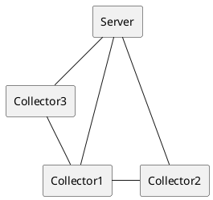

# Installation Guide
Todo

# How to run the software
The software contains of two parts. The server, that runs only once and is responsible for the orchestration of the tasks. In addition, there are $`n`$ many collectors, which gather the data the QoR-Manager needs to decide. 

The organisation might look like:

## Server
To start the server you can run it with the following options.

<-s> [-p &lt;port&gt;]

## Collector
To start a collector you can run it with the following options.

<-c> [-p &lt;server port&gt;] [-i &lt;server ip address&gt;]
